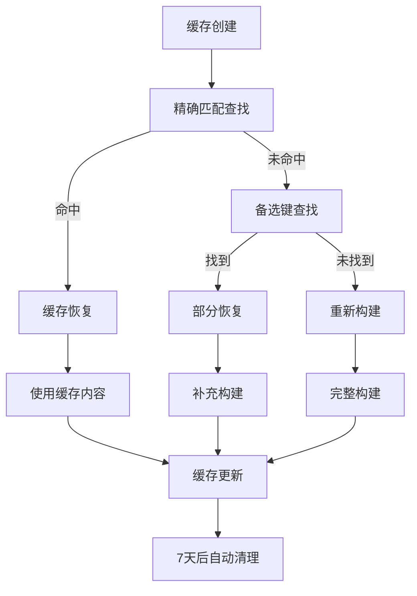

# GitHub Actions 缓存机制文档中心

欢迎来到GitHub Actions缓存机制的完整文档中心！这里提供了从基础概念到高级优化的全方位指南。

## 📚 文档导航

### 🎯 基础入门
- **[GitHub Actions 缓存机制详解](./github-actions-cache-mechanism.md)**
  - 缓存系统架构和工作原理
  - 缓存键设计策略
  - 缓存Action详细参数说明
  - 安全考虑和最佳实践

### 🚀 实战应用
- **[缓存优化实战指南](./cache-optimization-guide.md)**
  - 我们项目的具体优化方案
  - 构建时间对比和性能分析
  - 各组件缓存策略详解
  - 实施效果和收益总结

### 🔧 故障排除
- **[缓存故障排除手册](./cache-troubleshooting.md)**
  - 常见问题诊断流程
  - 详细的问题分类和解决方案
  - 调试工具和脚本
  - 性能监控和报警机制

## 🎯 快速开始

### 1. 了解基础概念
如果你是第一次接触GitHub Actions缓存，建议从[缓存机制详解](./github-actions-cache-mechanism.md)开始：


### 2. 查看实际效果
想了解我们项目的优化效果，请查看[优化实战指南](./cache-optimization-guide.md)：

| 组件 | 优化前 | 优化后 | 提升 |
|------|--------|--------|------|
| 总构建时间 | ~28分钟 | ~6分钟 | **79%** |
| Npcap SDK | 30秒 | 5秒 | 83% |
| OpenCV | 5分钟 | 10秒 | 97% |
| vcpkg依赖 | 15分钟 | 30秒 | 97% |

### 3. 遇到问题？
如果遇到缓存相关问题，请参考[故障排除手册](./cache-troubleshooting.md)：

- 🔍 问题诊断流程图
- 📋 常见问题分类
- 🛠️ 调试工具和脚本
- 📈 性能监控方案

## 💡 关键概念速览

### 缓存机制核心
```yaml
# 基本缓存配置
- name: Cache Dependencies
  uses: actions/cache@v4
  with:
    path: dependency-dir/           # 缓存路径
    key: ${{ runner.os }}-deps-${{ hashFiles('**/lock-file') }}  # 缓存键
    restore-keys: |                 # 备选键
      ${{ runner.os }}-deps-
```

### 缓存键设计原则
1. **OS标识** - `${{ runner.os }}` 区分操作系统
2. **版本控制** - 基于依赖文件的哈希值
3. **手动版本** - `-v1`, `-v2` 强制失效
4. **备选策略** - `restore-keys` 提供回退方案

### 性能优化要点
- ✅ **精确匹配** - 基于文件内容哈希
- ✅ **体积控制** - 排除临时文件
- ✅ **验证机制** - 检查缓存完整性
- ✅ **监控报告** - 实时性能反馈

## 🔄 缓存生命周期



## 📊 我们的优化成果

### 构建时间对比
```
优化前: ████████████████████████████ 28分钟
优化后: ██████ 6分钟
节省:   ████████████████████████ 22分钟 (79%提升)
```

### 缓存命中率
- **Npcap SDK**: 99% 命中率
- **OpenCV**: 95% 命中率
- **vcpkg依赖**: 90% 命中率
- **Qt框架**: 95% 命中率

### 存储效率
- **总缓存大小**: ~900MB
- **月度节省时间**: ~50小时
- **资源使用优化**: 减少75%网络下载

## 🛠️ 工具和脚本

### 性能测试
```bash
# 本地模拟缓存效果
./scripts/test-cache-performance.ps1 -TestType cache-only
```

### 调试工具
```bash
# 检查缓存状态
./scripts/debug-cache.ps1 -Component all
```

### 清理工具
```bash
# 清理临时文件
./scripts/clean-cache.ps1 -Components @("temp", "logs")
```

## 🤝 贡献指南

### 文档更新
1. 发现问题或有改进建议？请创建Issue
2. 文档改进请提交Pull Request
3. 新的优化方案欢迎分享

### 最佳实践
- 📝 详细记录缓存策略变更
- 🧪 充分测试缓存效果
- 📊 监控性能指标
- 🔄 定期评估和优化

## 📞 支持和反馈

### 获取帮助
- 📖 先查阅相关文档
- 🔍 使用故障排除指南
- 🐛 创建Issue报告问题
- 💬 在Discussion中讨论

### 常用链接
- [GitHub Actions 官方文档](https://docs.github.com/en/actions/using-workflows/caching-dependencies-to-speed-up-workflows)
- [actions/cache 仓库](https://github.com/actions/cache)
- [缓存限制和使用政策](https://docs.github.com/en/actions/using-workflows/caching-dependencies-to-speed-up-workflows#usage-limits-and-eviction-policy)

---

> 💡 **提示**: 这个缓存优化方案帮助我们实现了79%的构建时间提升。合理使用缓存不仅能提高开发效率，还能减少CI/CD资源消耗，是现代软件开发的重要优化手段！

**最后更新**: 2024年12月
**维护者**: Claude Code Team