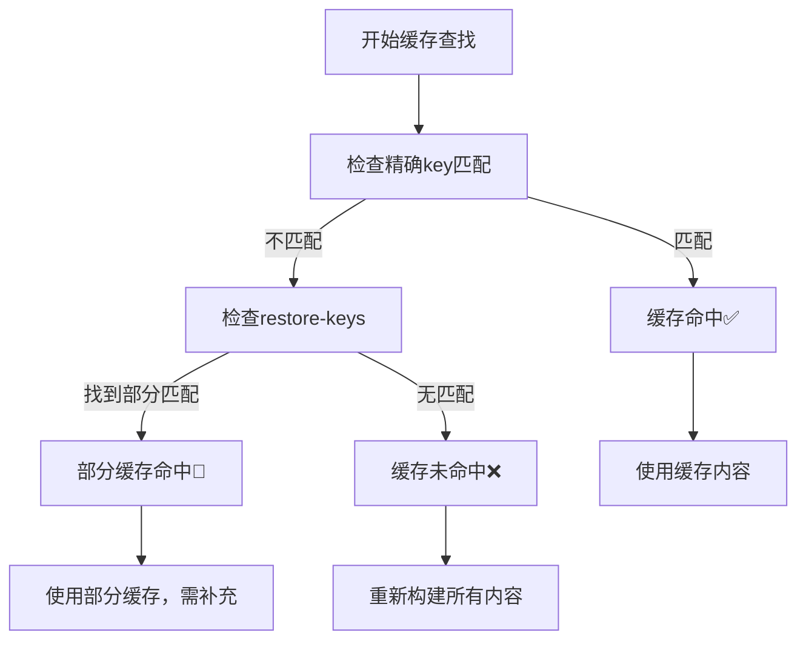

# GitHub Actions 缓存机制详解

## 🎯 什么是GitHub Actions缓存？

GitHub Actions缓存是一个分布式存储系统，允许在workflow运行之间保存和恢复文件和目录。它的核心目标是**避免重复下载和构建**，从而显著减少CI/CD流水线的执行时间。

## 🏗️ 缓存系统架构

### 存储模型
```
GitHub Actions缓存存储
├── 仓库级别隔离 (每个repo独立)
├── 分支级别共享 (默认分支可被其他分支访问)
├── Pull Request隔离 (PR只能访问目标分支缓存)
└── 版本控制 (基于key的精确匹配)
```

### 存储位置
- **物理位置**: GitHub的分布式存储集群
- **访问范围**: 仅限当前仓库
- **生命周期**: 7天未访问自动删除
- **容量限制**: 10GB (免费账户) / 无限制 (付费账户)

## 🔑 缓存键 (Cache Key) 机制

### 缓存键的构成
```yaml
key: ${{ runner.os }}-vcpkg-redis-mysql-v2-${{ hashFiles('**/CMakeLists.txt') }}
```

**组成部分解析:**
1. **`${{ runner.os }}`** - 操作系统标识符 (Windows/Linux/macOS)
2. **`vcpkg-redis-mysql`** - 缓存内容描述
3. **`v2`** - 手动版本控制
4. **`${{ hashFiles('**/CMakeLists.txt') }}`** - 文件内容哈希

### 缓存查找流程



### 示例：缓存键设计策略

```yaml
# 1. 静态缓存 (依赖版本不变时永久有效)
key: Windows-npcap-sdk-1.15-v1

# 2. 动态缓存 (基于文件内容哈希)
key: Windows-vcpkg-${{ hashFiles('vcpkg.json', 'CMakeLists.txt') }}

# 3. 分层缓存 (多级回退)
key: Windows-deps-v3-${{ hashFiles('**/package.json') }}
restore-keys: |
  Windows-deps-v3-
  Windows-deps-
```

## ⚙️ 缓存Action详解

### actions/cache@v4 参数

```yaml
- name: Cache Example
  uses: actions/cache@v4
  id: my-cache              # 缓存步骤ID，用于后续引用
  with:
    path: |                 # 缓存路径（支持多路径和glob模式）
      ~/.npm
      node_modules
      !node_modules/.bin    # 排除特定路径
    key: ${{ runner.os }}-node-${{ hashFiles('package-lock.json') }}
    restore-keys: |         # 备选缓存键（按顺序尝试）
      ${{ runner.os }}-node-
      ${{ runner.os }}-
    lookup-only: false      # 仅查找不保存
    fail-on-cache-miss: false # 缓存未命中时是否失败
```

### 缓存状态检查

```yaml
- name: Use cached data
  if: steps.my-cache.outputs.cache-hit == 'true'
  run: echo "缓存命中！跳过构建步骤"

- name: Build from scratch
  if: steps.my-cache.outputs.cache-hit != 'true'
  run: echo "缓存未命中，执行完整构建"
```

## 🛠️ 实际应用案例

### 案例1: Node.js依赖缓存

```yaml
- name: Cache Node.js dependencies
  uses: actions/cache@v4
  with:
    path: |
      ~/.npm
      node_modules
    key: ${{ runner.os }}-node-${{ hashFiles('package-lock.json') }}
    restore-keys: |
      ${{ runner.os }}-node-

- name: Install dependencies
  if: steps.cache.outputs.cache-hit != 'true'
  run: npm ci
```

**优势**: package-lock.json不变时，跳过npm install

### 案例2: C++编译缓存 (我们的vcpkg案例)

```yaml
- name: Cache vcpkg
  uses: actions/cache@v4
  with:
    path: |
      C:\vcpkg
      !C:\vcpkg\.git          # 排除git历史
      !C:\vcpkg\buildtrees    # 排除临时构建文件
      !C:\vcpkg\downloads     # 排除下载缓存
    key: ${{ runner.os }}-vcpkg-${{ hashFiles('vcpkg.json') }}
```

**优势**: 编译好的库直接复用，避免重新编译

### 案例3: Docker层缓存

```yaml
- name: Cache Docker layers
  uses: actions/cache@v4
  with:
    path: /tmp/.buildx-cache
    key: ${{ runner.os }}-buildx-${{ github.sha }}
    restore-keys: |
      ${{ runner.os }}-buildx-
```

## 🔄 缓存生命周期

### 创建阶段
1. **触发条件**: 缓存键不存在时
2. **保存时机**: workflow步骤成功完成后
3. **保存内容**: path指定的所有文件和目录

### 使用阶段
1. **查找顺序**: key → restore-keys (按顺序)
2. **匹配规则**: 精确匹配 > 前缀匹配
3. **恢复速度**: 通常几秒到几十秒

### 过期阶段
1. **自动清理**: 7天未访问
2. **容量限制**: 超出限制时删除最旧的缓存
3. **手动清理**: 通过GitHub界面或API

## 💡 缓存优化最佳实践

### 1. 缓存键设计原则

```yaml
# ✅ 好的缓存键
key: ${{ runner.os }}-deps-${{ hashFiles('**/package.json') }}-v1

# ❌ 不好的缓存键
key: cache-${{ github.run_number }}  # 每次都不同，永远不会命中
```

### 2. 路径选择策略

```yaml
# ✅ 精确缓存
path: |
  ~/.gradle/caches
  ~/.gradle/wrapper

# ❌ 过度缓存
path: ~/  # 缓存整个用户目录，太大且包含临时文件
```

### 3. 分层缓存策略

```yaml
# 基础依赖缓存 (变化少)
- name: Cache base dependencies
  key: base-deps-${{ hashFiles('requirements.txt') }}

# 构建缓存 (变化频繁)
- name: Cache build artifacts
  key: build-${{ github.sha }}-${{ hashFiles('src/**') }}
```

## 🚨 常见问题和解决方案

### 问题1: 缓存命中率低

**原因分析**:
- 缓存键包含易变的值 (如时间戳)
- 文件路径不准确
- 缓存的内容经常变化

**解决方案**:
```yaml
# 问题代码
key: cache-${{ github.run_number }}-${{ github.run_attempt }}

# 修正代码
key: ${{ runner.os }}-deps-${{ hashFiles('package-lock.json') }}
restore-keys: |
  ${{ runner.os }}-deps-
```

### 问题2: 缓存大小过大

**原因分析**:
- 包含了不必要的文件
- 没有排除临时文件和日志

**解决方案**:
```yaml
path: |
  node_modules
  !node_modules/.cache     # 排除缓存目录
  !node_modules/*/logs     # 排除日志文件
  !**/*.log                # 排除所有日志文件
```

### 问题3: 缓存损坏

**检测方法**:
```yaml
- name: Validate cache
  run: |
    if [ ! -f "expected-file" ]; then
      echo "缓存损坏，强制重建"
      rm -rf cached-directory
    fi
```

**修复策略**:
```yaml
# 增加版本号强制重建
key: ${{ runner.os }}-deps-v2-${{ hashFiles('package.json') }}
```

## 📊 缓存性能监控

### 监控指标

```yaml
- name: Cache Performance Report
  run: |
    echo "=== 缓存性能报告 ==="
    echo "缓存命中: ${{ steps.cache.outputs.cache-hit }}"
    echo "缓存键: ${{ env.CACHE_KEY }}"

    # 计算文件大小
    if [ -d "cached-dir" ]; then
      echo "缓存大小: $(du -sh cached-dir | cut -f1)"
    fi

    # 计算时间节省
    START_TIME=${{ env.STEP_START_TIME }}
    END_TIME=$(date +%s)
    echo "耗时: $((END_TIME - START_TIME)) 秒"
```

### 性能基准测试

```bash
# 测试脚本示例
# 测试不同缓存策略的效果

# 测试1: 无缓存
time npm install  # 基准时间

# 测试2: 有缓存
time npm ci       # 对比时间

# 计算提升
improvement=$(( (baseline - cached) * 100 / baseline ))
echo "性能提升: ${improvement}%"
```

## 🔐 缓存安全考虑

### 敏感信息保护

```yaml
# ❌ 不要缓存敏感信息
path: |
  ~/.ssh              # SSH密钥
  ~/.aws/credentials  # AWS凭证
  .env                # 环境变量文件

# ✅ 只缓存公开的构建产物
path: |
  node_modules
  dist
  build
```

### 访问控制

```yaml
# 缓存访问规则:
# 1. 同一仓库内共享
# 2. Pull Request 只能读取目标分支缓存
# 3. Fork 的仓库无法访问原仓库缓存
```

## 📈 缓存效果评估

### 关键指标

| 指标 | 目标值 | 监控方法 |
|------|--------|----------|
| **缓存命中率** | >80% | `steps.cache.outputs.cache-hit` |
| **时间节省** | >50% | 对比有无缓存的构建时间 |
| **存储效率** | <5GB | 监控缓存总大小 |
| **缓存寿命** | >3天 | 监控缓存被清理的频率 |

### 优化建议

1. **定期审查**: 每月检查缓存策略有效性
2. **版本管理**: 重大更新时升级缓存版本
3. **监控告警**: 缓存命中率低于阈值时告警
4. **成本控制**: 合理控制缓存大小和数量

---

> 💡 **总结**: GitHub Actions缓存是一个强大的性能优化工具，合理使用可以将构建时间减少60-80%。关键在于设计好缓存键、选择合适的缓存内容，并建立有效的监控机制。